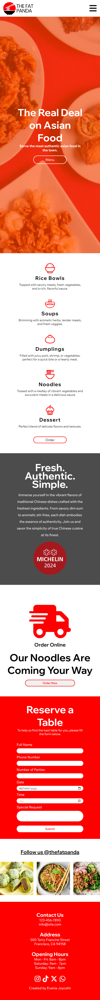

# Documentation for "The Fat Panda" Restaurant Website

## 1. Overview

The Fat Panda is a restaurant website designed to showcase the menu, offer online orders, and allow reservations. The site is fully responsive and optimized for various devices.

You can visit the site [here](https://milestone.evaniajoycelin.site/)

## 2. Setup Instructions

### Prerequisites

- A web browser
- Internet connection

**Clone the Repository:**

   ```bash
   git clone git@github.com:revou-fsse-5/milestone-1-evaniaanthony.git
   ```
## 3. Dependencies and External Libraries
__a. Font Awesome:__
Purpose: Used for adding icons, including the hamburger menu icon and social media icons.
How to get start with Font Awesome please go [here](https://docs.fontawesome.com/web/setup/get-started). 

__b. Google Fonts:__

* [Wix Madefor Text](https://fonts.google.com/specimen/Wix+Madefor+Text?query=madef)
* [Wix Madefor Display](https://fonts.google.com/specimen/Wix+Madefor+Display?query=madef)

Custom fonts used for headings, paragraphs, buttons, and other text elements to enhance the visual appeal. How to get start with goolge fonts please go [here](https://developers.google.com/fonts/docs/css2).

## 4. Design Choices and Considerations
a. Responsive Design:

The website is designed to be fully responsive, providing a good user experience across different devices (desktops, tablets, and mobile phones).

Desktop:

Tablet:

Mobile:


Media queries are used to adjust styles for different screen sizes, ensuring the layout remains user-friendly and visually appealing.


b. Navigation Bar:

The navigation bar includes a logo, a hamburger menu for smaller screens, and navigation links.
On larger screens, the navigation links and buttons are displayed inline.
On smaller screens, the hamburger menu replaces the navigation links, which can be toggled to show the navigation content.


c. Banner Section:

The banner section includes a background image with an overlay to ensure text readability.
Centralized content with a heading, subheading, and button to create a visually engaging introduction.


d. Product Section:

Grid layout to showcase different product categories.
Each product includes an image, title, and description.
A central button for ordering is provided at the bottom of the section.


e. About Section:

Background image with a dark overlay to enhance text readability.
Focuses on the restaurant's core values with bold headings and descriptive text.
Includes a prominent image for visual appeal.


f. Reservation Section:

Split layout with an order online section and a reservation form.
Clear instructions and required fields for users to make reservations easily.
Consistent design with a red and white color scheme.


g. Gallery Section:

Horizontal scroll grid to showcase images of food items.
Hover effect on images to make the gallery interactive.


h. Footer:

Contact information, address, and opening hours are provided.
Social media icons for user engagement.
Consistent design with the rest of the website.


